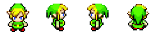
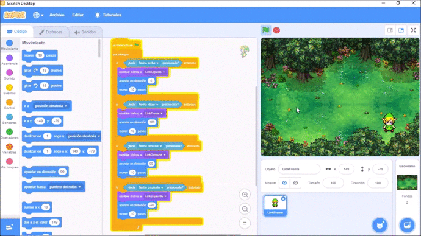
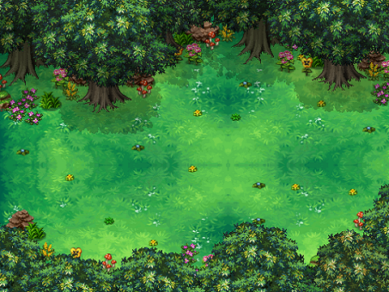

# Zelda en Scratch
Este repositorio esta destinado al uso del software de programación Scratch para incentivar el juego, el aprendizaje de programación y la animación desarrollado por niños.

El personaje de Link fue obtenido de Bianca Pangilinan en el siguiente link:
https://www.pinterest.es/pin/759067712177999843/

El juego se desarrolla moviendo el personaje a lo largo del mapa usando las fechas del techado para desplazarse a lo largo del mapa.

El fondo del juego fue tomado de DopellSerch en DeviantArt encontrado en el siguiente link:
https://www.pinterest.es/pin/392939136223173231/
